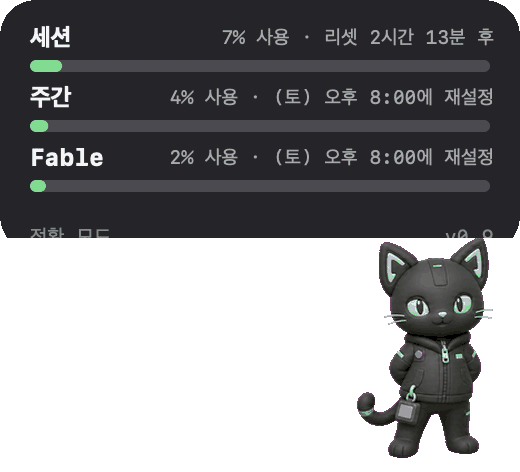

# 🐱 Claude Pet (Patch エディション)

[English](README.md) · [한국어](README.ko.md) · **日本語** · [Español](README.es.md)

Codex Pets のように、画面に浮かぶ Patch が Claude のトークン使用量を見守るデスクトップペット。
macOS ネイティブ（AppKit）描画 — ウィンドウ枠・背景・残像なし。

> 🧪 現在 **v0.1 (beta)** — 実験段階のため、挙動や表記が変わることがあります。



## ダウンロードとインストール（推奨）

**Python 不要** — アプリに同梱されており、**Apple の公証（notarize）済み**なので Gatekeeper の警告なしで開けます。

1. [**Releases**](https://github.com/uygnoey/claude-pet/releases/latest) から `ClaudePet.zip` をダウンロード
2. 展開 → `ClaudePet.app` を **アプリケーション** フォルダへ移動 → ダブルクリック
3. macOS 12+（Apple Silicon）

### 権限（初回起動時）

ペットは **`~/.claude`（使用量ログ）とキーチェーンの OAuth トークン** だけを読みます。他のフォルダ（写真・ダウンロード・書類…）には一切触れません。初回起動時に出るのはこれだけです:

| ダイアログ | 内容 | 選ぶ |
|---|---|---|
| **キーチェーン** — "Claude Code-credentials" | 正確モードがサーバー計算の % を取得する OAuth トークン | **常に許可** |
| **「他のAppのデータ」** — `~/.claude` | 使用量ログの読み取り | **許可** |

- トークンは **起動ごとに1回だけ** 読み、署名済みアプリなので決定は保存され、二度と聞かれません。
- **写真／ダウンロード／ミュージック／デスクトップ／書類／iCloud／ネットワークボリュームのダイアログは出ません。**（以前はペットが `claude` CLI を子プロセスとして起動し、そのホームスキャンがアプリに帰属して出ていましたが、その CLI 呼び出しは既定でオフにしました。）
  - モデル別（Fable）の行を CLI で補完したい場合は `CLAUDE_PET_USE_CLI=1` を指定できますが、その場合フォルダのダイアログが再び出ます。

### アップデート

起動時に GitHub の最新リリースを確認し、新しいバージョンがあれば **右クリック →「⬆︎ 新しいバージョンをインストール」** でダウンロード・置換・再起動まで自動で行います。

---

## ソースからビルド（開発者向け）

ソースからビルドするには **framework ビルドの Python** が必要です:

- **Homebrew**: `brew install python@3.13`（すでに framework ビルド）
- **pyenv**: `--enable-framework` 付きでインストール
  ```bash
  PYTHON_CONFIGURE_OPTS="--enable-framework" pyenv install 3.13.14 && pyenv global 3.13.14
  ```
  > ⚠️ システムの Python（`/usr/bin/python3`, 3.9）は pyobjc のビルドが壊れるため使わないでください。

```bash
./build_app.sh install     # ローカルでビルド+署名 → /Applications にインストールして実行
python3 claude_pet.py --report   # GUI なしのターミナルレポートのみ

./release.sh               # 配布用の自己完結アプリ（py2app）+ Developer ID 署名 + 公証 + zip
```
`release.sh` は初回のみ公証用の資格情報の登録が必要です（スクリプト冒頭のコメント参照）。

## 挙動

- **普段はじっとしている** — 最初のフレームで静止、25秒に1回だけ呼吸／まばたき
- **マウスが近づくと** — 手を振って挨拶（クールダウン30秒）
- **つかんでドラッグ** — 引っ張る方向へ走る。**ダブルクリック** = ジャンプ + **使用量を即時更新**（キャッシュ無視の再取得）
- **トークン消費が急増すると** — 体が警告色でパルス + パニック顔 + ゲージに ▲急増:
  - 🔴 セッション急増 / 🟣 モデル（Fable/Opus）急増 / 🟠 週間急増
- **セッションのリセットを検知すると** — 喜んでジャンプ

## 操作

- **スクロール（ペットの上で）**: サイズ変更（0.3×〜2.0×、保存。既定 0.5×）
- **クリック（⌄ ボタン）**: ゲージパネルの折りたたみ／展開
- **ドラッグ**: 移動（位置を保存）
- **右クリック**: メニュー — 設定 / 折りたたみ / サイズを元に戻す / 終了

## 3種のゲージ（サブスクリプションモード）

セッション（5h）/ 週間合計 / 週間モデル別 — それぞれ %、残りトークン、リセットまでのカウントダウン。
モデル別ゲージはログから上位ティア（fable → mythos → opus）を **自動検出** します。

## 設定（右クリック → 設定）

- **データソース**: サブスクリプション（Claude Code のログ）/ API（Admin API コスト — 今日・今月・月次予算ゲージ）
- **🔧 キャリブレーション（最重要！）**: トークンの上限は Anthropic 非公開で誰も分かりません。
  代わりに Claude アプリの **設定 > 使用状況** に表示される % を入力して保存すると、アプリが
  `上限 = 現在の使用量 ÷ %` を逆算します。入力した項目だけが反映されます。
- **週間リセットの曜日／時刻**: アプリに「土 20:00 にリセット」と出るなら 土曜/20時 に設定。未設定なら7日ローリング。
- モデルキーワード（auto 推奨）、急増感度、マウス挨拶の on/off、Admin API キー、月次予算

すべての設定・サイズ・位置は `~/.claude_pet.json` に保存されます。

## 制限（正直に）

- データは Claude Code のローカルログ基準 — Web/デスクトップのチャット使用量は含まれません。そのためアプリの % より低く出ることがあり、定期的に再キャリブレーションすると正確になります。
- Admin API のコストは Console の組織のもので、サブスクリプションの上限とは別です。
- Admin API キーは `~/.claude_pet.json` に平文で保存されるため、個人のマシンでのみ使用してください。
